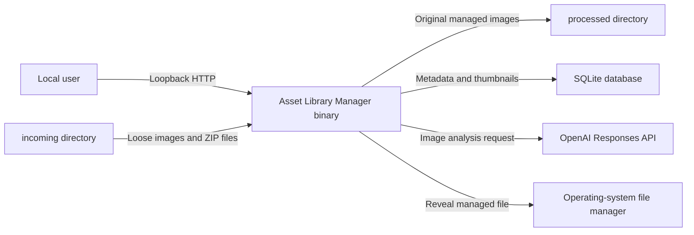
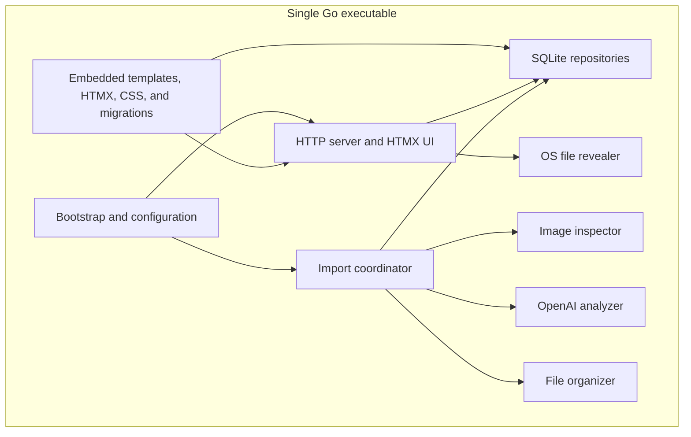
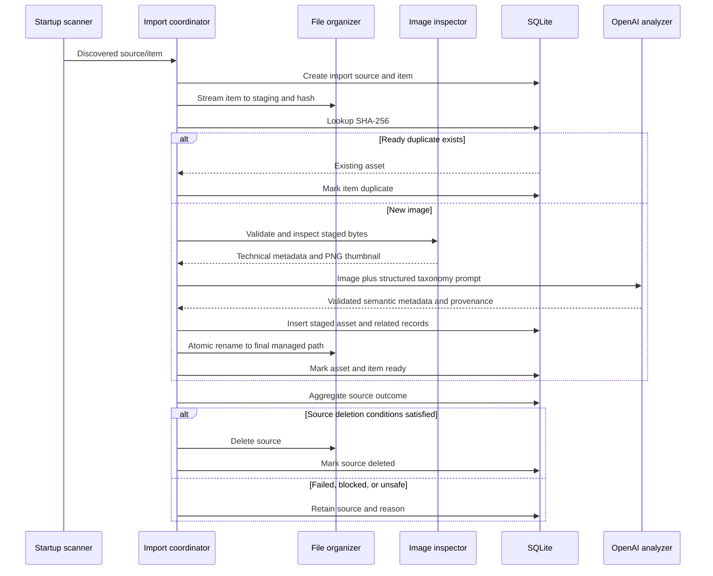
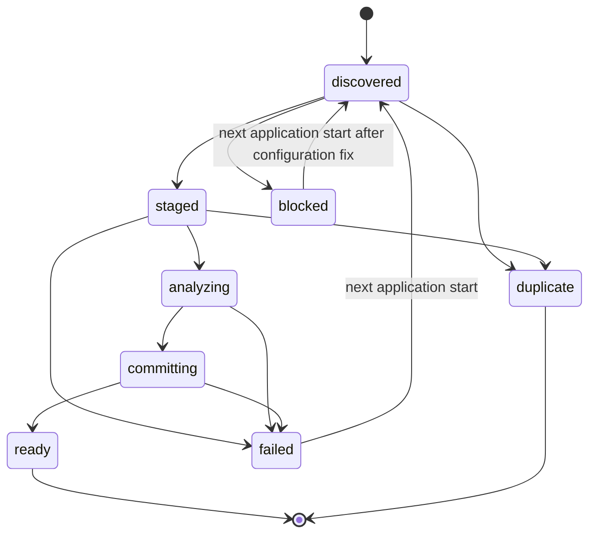

# Asset Library Manager

## Software Design Document

| Attribute | Value |
| --- | --- |
| Status | Draft |
| Version | 0.3 |
| Last updated | 2026-08-12 |
| Intended audience | Implementers and maintainers |

## 1. Purpose

Asset Library Manager is a local web application for importing, organizing, describing, searching, and retrieving image assets. It is intended for a single trusted user and is not designed to be published on the Internet or exposed to a local network.

The application is implemented in Go 1.26 or newer and distributed as one self-contained executable. The executable embeds the web UI, HTMX library, styles, templates, and database migrations. Runtime state consists of an optional-on-first-run JSON configuration file, a SQLite database, an incoming directory, and a processed-assets directory located beside the executable. Missing runtime state is bootstrapped automatically when doing so cannot orphan managed data. OpenAI is the only external runtime service.

This document defines the v1 behavior and the boundaries within which implementation decisions may be made.

## 2. Goals and non-goals

### 2.1 Goals

- Import loose images and ZIP archives from a known local directory.
- Preserve the original image encoding while placing assets into a consistent, readable directory structure.
- Extract objective image properties locally.
- Use OpenAI vision analysis to generate a title, description, primary asset type, style, confidence, and rich tags.
- Store searchable metadata and preview thumbnails in SQLite.
- Browse, search, filter, sort, inspect, and correct metadata in an embedded local web UI.
- Download a managed image or reveal it in the operating system's file manager.
- Prevent data loss by deleting source inputs only after durable, verified processing.
- Recover safely from restarts, duplicate inputs, partial ZIP processing, and transient external-service failures.
- Build for Windows, macOS, and Linux without CGO or a frontend runtime.

### 2.2 Non-goals

The following are outside v1:

- Internet or LAN deployment.
- Authentication, authorization, or multiple users.
- Providers other than OpenAI.
- Cloud storage, synchronization, or sharing.
- SVG, video, audio, 3D, font, or document assets.
- Nested archives.
- Vector embeddings or semantic search.
- Automatic filesystem watching or a manual rescan command.
- Asset deletion through the UI.
- AI reanalysis through the UI.
- Editing or transforming managed original image pixels. Thumbnail generation and a bounded, transient AI-analysis rendition are permitted; neither changes the managed original.
- Moving or renaming managed files after metadata is manually edited.

## 3. Definitions

| Term | Definition |
| --- | --- |
| Application root | The resolved directory containing the running executable. |
| Source | A loose image or ZIP file discovered in `incoming/`. |
| Import item | One supported image, either a loose source or a member of a ZIP source. |
| Managed asset | An original image that has been durably placed under `processed/` and recorded in SQLite. |
| Technical metadata | Objective facts derived locally from image bytes. |
| Semantic metadata | Descriptive values generated by AI and subsequently editable by the user. |
| Ready | The asset file and all required database records are durable and available to the catalog. |
| Duplicate | An import item whose SHA-256 digest already belongs to a ready managed asset. |

## 4. System context and constraints



The user must understand that asset image data is sent to OpenAI for categorization. The application itself remains local, but AI processing is neither offline nor self-hosted.

### 4.1 Runtime layout

All application paths are resolved from the application root, not the shell's current working directory.

```text
<application-root>/
  asset-library-manager[.exe]
  config.json
  assets.db
  incoming/
  processed/
    .staging/
    <primary-type>/
      <title-slug>--<sha256-prefix>.<ext>
```

The application atomically creates a default `config.json` when it is absent, then creates `incoming/`, `processed/`, and `processed/.staging/` when they do not exist. A missing database is created and migrated automatically only when `processed/` is absent or contains no managed or staged content. Empty directories and an empty `processed/.staging/` do not count as content. Any file at any managed depth, or any entry inside `.staging/`, causes a fatal recovery error before the database file or directories are created. After startup validation, all routine incoming and processed-file operations use Go's root-scoped filesystem API (`os.Root`) with validated relative paths; string-prefix containment checks are not a security boundary.

An existing corrupt, unreadable, incompatible, or migration-checksum-conflicted database is evidence, not disposable state. Startup preserves it and exits non-zero. The supported recovery is to restore the matching `assets.db` or move the processed content to a safe location before intentionally creating a new catalog.

The application must reject configuration in which paths overlap, escape the application root, refer through symlinks outside the application root, or cause `incoming/`, `processed/`, and the database to alias one another.

## 5. Requirements

### 5.1 Functional requirements

| ID | Requirement |
| --- | --- |
| FR-001 | Resolve configuration and data paths from the executable directory. |
| FR-002 | Bind the HTTP server only to a loopback address. |
| FR-003 | Serve the existing catalog even when OpenAI is unavailable or misconfigured. |
| FR-004 | Start exactly one background scan of `incoming/` after HTTP and SQLite initialization. |
| FR-005 | Accept loose PNG, JPEG, WebP, and GIF files and ZIP archives containing those formats. |
| FR-006 | Validate file content rather than trusting filenames or archive metadata. |
| FR-007 | Deduplicate import items by SHA-256 digest. |
| FR-008 | Extract technical metadata and generate a PNG thumbnail locally. |
| FR-009 | Generate schema-constrained semantic metadata through the OpenAI Responses API. |
| FR-010 | Place original image bytes at a stable, readable, collision-safe managed path. |
| FR-011 | Persist assets, thumbnails, tags, imports, and AI provenance in SQLite. |
| FR-012 | Delete a source only when all deletion preconditions are durably satisfied. |
| FR-013 | Provide paginated catalog browsing, text search, sorting, and combinable filters. |
| FR-014 | Allow title, description, primary type, style, pixel-art status, and tags to be corrected. |
| FR-015 | Download a managed asset and reveal its location in the OS file manager. |
| FR-016 | Display startup-processing progress and actionable failures in the UI. |
| FR-017 | Reconcile interrupted processing on each application start. |

### 5.2 Quality requirements

| ID | Requirement |
| --- | --- |
| NFR-001 | Produce one Go executable with no required Node.js, CDN, browser extension, or CGO dependency. |
| NFR-002 | Run on supported Windows, macOS, and Linux targets. |
| NFR-003 | Be idempotent: reprocessing identical bytes must not create a second managed asset. |
| NFR-004 | Never delete a source before the managed file and required database records are ready. |
| NFR-005 | Keep catalog reads available while background processing is running or blocked. |
| NFR-006 | Treat filenames, archives, images, AI output, HTTP input, and database paths as untrusted data. |
| NFR-007 | Never log the OpenAI API key or expose it to the browser. |
| NFR-008 | Use bounded memory, archive, image, retry, and concurrency limits. |
| NFR-009 | Emit structured operational logs to standard error and retain user-visible import errors in SQLite. |
| NFR-010 | Shut down cooperatively: stop accepting new work, cancel and join every application goroutine, preserve recoverable import state, and close resources in dependency order. |
| NFR-011 | Pin and verify the Go module dependency graph, and gate releases on tests, race detection, static analysis, and reachable-vulnerability scanning. |

## 6. Architecture

The application is a modular monolith with manual constructor injection. Interfaces are defined by the package that consumes them, kept to the smallest useful contract, and introduced only at real test or implementation boundaries. Constructors return concrete types. The composition root owns process lifecycle and wires filesystem, OpenAI, SQLite, and OS adapters explicitly; packages must not use service locators, mutable globals, or side-effecting `init` functions.



### 6.1 Module responsibilities

| Module | Responsibilities |
| --- | --- |
| Bootstrap | Locate the executable, load and validate configuration, create managed directories, open SQLite, apply migrations, construct dependencies, run recovery, start HTTP and the single scan, coordinate signals, and shut down in dependency order. |
| HTTP/UI | Render full pages and HTMX fragments, validate form input, enforce CSRF and host rules, stream downloads, and expose catalog and processing views. |
| Import coordinator | Discover sources, create import records, schedule bounded work, enforce state transitions, aggregate ZIP outcomes, and decide source deletion. |
| Image inspector | Validate magic bytes, decode metadata safely, apply display orientation, count frames, detect alpha, calculate dominant colors, and create bounded thumbnail and AI-analysis renditions. |
| OpenAI analyzer | Build vision requests, request structured output, classify retryable errors, validate responses, and retain provenance. |
| File organizer | Use root-scoped paths, durably stage and hash bytes, generate safe final paths, promote without unrelated overwrite, reconcile filesystem state, and delete verified eligible sources. |
| SQLite repositories | Own connection configuration, writer serialization, transactions, queries, full-text indexing, pagination, migrations, and persistence of import and AI state. |
| OS file revealer | Reveal a database-resolved managed file with OS-specific commands without invoking a shell. |

### 6.2 Implementation boundaries

- Use `go:embed` for templates, HTMX, CSS, icons, and SQL migrations.
- Target Go 1.26 and use the latest supported Go 1.26 patch release in builds. As of this revision, Go 1.26 is the current stable line and the [Go 1.27 release notes](https://go.dev/doc/go1.27) are still marked draft; do not depend on draft Go 1.27 behavior. Track patch releases through the official [Go release history](https://go.dev/doc/devel/release).
- Use one module whose path matches the repository, commit `go.sum`, and compile all runtime dependencies into the executable. Vendoring is optional, not a substitute for checksum verification.
- Use a pure-Go SQLite driver built with FTS5 support.
- Use Go's `html/template` auto-escaping for HTML.
- Avoid inline scripts so a restrictive Content Security Policy can be applied.
- Use explicit constructors and manual dependency injection at the composition root. Global mutable state is prohibited; package-level immutable embedded resources and compiled regular expressions are allowed.
- Accept `context.Context` as the first parameter at cancellation-aware boundaries and propagate the caller's context unchanged. Do not store contexts in structs or create `context.Background()` inside a request or import path.
- Filesystem APIs that do not natively accept a context must check cancellation before opening, between bounded streaming chunks, and before durable state transitions. A context parameter does not imply that a single blocking operating-system call can be interrupted.
- Prefer the standard library. Any third-party runtime dependency requires a recorded rationale, compatible license, maintained upstream, pure-Go cross-platform support, and review of its effect on binary size and attack surface.

### 6.3 Package and dependency direction

The initial package layout should remain small and domain-oriented:

```text
cmd/asset-library-manager/      minimal main package and composition root
internal/app/                   lifecycle, startup, shutdown, and recovery orchestration
internal/config/                JSON loading and validated configuration
internal/catalog/               catalog queries and metadata use cases
internal/importer/              discovery, state machine, workers, and source aggregation
internal/imageinspect/          technical inspection and derived renditions
internal/openai/                Responses API adapter and response validation
internal/sqlite/                migrations, transactions, repositories, and FTS5
internal/storage/               root-scoped staging, promotion, verification, and deletion
internal/web/                   handlers, templates, middleware, and embedded assets
internal/platform/              operating-system reveal adapter
internal/testsupport/           shared test builders and fixtures only
```

`cmd` contains wiring and exit-code handling, not business logic. Application and domain packages may depend on consumer-owned ports and standard-library types; adapters depend inward on those contracts. Packages named `utils`, `common`, `helpers`, or `models` are prohibited because they obscure ownership. No public `pkg/` tree is needed for this application.

The initial dependency strategy is manual constructor injection. A DI framework, ORM, logging framework, or general-purpose web framework must not be introduced without an SDD or architecture-decision update demonstrating a concrete need.

### 6.4 Core Go interfaces

Interfaces live beside their consumers. Representative contracts are:

```go
// Defined by the importer, implemented by the SQLite adapter.
type ReadyAssetFinder interface {
    FindReadyByDigest(ctx context.Context, digest [sha256.Size]byte) (AssetRef, error)
}

type AssetStager interface {
    CreateStaged(ctx context.Context, input CreateAssetInput) (StagedAsset, error)
    MarkReady(ctx context.Context, assetID AssetID, managedPath string) error
}

// Defined by the catalog use case, implemented by the SQLite adapter.
type CatalogReader interface {
    Search(ctx context.Context, query AssetQuery) (Page[AssetSummary], error)
    Get(ctx context.Context, assetID AssetID) (AssetDetail, error)
}

type MetadataUpdater interface {
    UpdateSemanticMetadata(ctx context.Context, assetID AssetID, edit MetadataEdit) error
}

type Analyzer interface {
    Analyze(ctx context.Context, image ImageInput) (AnalysisResult, AnalysisProvenance, error)
}

type Inspector interface {
    Inspect(ctx context.Context, source io.ReadSeeker, limits ImageLimits) (Inspection, error)
}

type Stager interface {
    Stage(ctx context.Context, source io.Reader, limits StageLimits) (StagedFile, error)
    Promote(ctx context.Context, staged StagedFile, destination ManagedPath) error
}

type Revealer interface {
    Reveal(ctx context.Context, managedPath ManagedPath) error
}
```

`Inspection` contains technical metadata, the PNG thumbnail, and the bounded AI-analysis rendition so the staged file is not repeatedly decoded by unrelated components. Value types represent validated IDs, digests, states, and managed relative paths; the zero value of enum-like state types is `unknown` and is never a valid persisted state.

Repository errors must expose not-found and conflict semantics through `errors.Is`. External-service failures use typed errors inspectable with `errors.Is` or `errors.As` and distinguish retryable, permanent, refused, invalid-response, configuration, cancellation, and deadline failures. Implementations wrap errors with `%w`; an error is logged once at the outer boundary that handles it, not at every layer it crosses.

## 7. Configuration

`config.json` must be valid JSON and is loaded once at startup through a size-limited reader. Configuration reload requires an application restart. Unknown fields, duplicate object keys, trailing JSON values, and non-finite or overflowing numbers are rejected so ambiguous configuration never reaches runtime.

```json
{
  "server": {
    "host": "127.0.0.1",
    "port": 7342,
    "open_browser": true,
    "shutdown_timeout_seconds": 15
  },
  "storage": {
    "database": "assets.db",
    "incoming_directory": "incoming",
    "processed_directory": "processed"
  },
  "processing": {
    "workers": 2,
    "thumbnail_max_dimension": 320,
    "analysis_max_dimension": 1536,
    "max_analysis_bytes": 20971520,
    "max_source_bytes": 536870912,
    "max_image_pixels": 100000000,
    "archive": {
      "max_entries": 2000,
      "max_entry_bytes": 268435456,
      "max_total_uncompressed_bytes": 1073741824,
      "max_compression_ratio": 200
    }
  },
  "openai": {
    "api_key": "",
    "model": "gpt-5.6-terra",
    "reasoning_effort": "medium",
    "image_detail": "auto",
    "timeout_seconds": 90,
    "max_attempts": 3,
    "initial_retry_delay_ms": 1000
  }
}
```

### 7.1 Validation rules

- `server.host` must parse as an IPv4 or IPv6 loopback address. Wildcard, LAN, and public addresses are invalid.
- `server.port` must be between 1 and 65535.
- `server.open_browser` defaults to `true` and controls only the non-fatal post-start browser launch.
- `server.shutdown_timeout_seconds` must be positive and is capped by a hard implementation ceiling.
- Storage paths must be non-empty, relative, normalized paths contained by the application root.
- Storage paths must not overlap or resolve through symlinks outside the application root.
- Worker and size limits must be positive and within implementation-defined hard safety ceilings.
- `thumbnail_max_dimension` defaults to and must not exceed 320 in v1.
- `analysis_max_dimension` defaults to 1536 and bounds the longest side of the transient AI rendition; `max_analysis_bytes` bounds its encoded size. Neither rendition is upscaled.
- `reasoning_effort` accepts values supported by the configured model; configuration validation may defer model-specific rejection to the API.
- `image_detail` accepts `low`, `high`, or `auto`.
- Retry attempts include the initial attempt and must be between 1 and 10.
- `openai.api_key` is the sole API-key source. It may be empty, must not contain leading/trailing whitespace or control characters, and is redacted from logs. `OPENAI_API_KEY` and other environment variables are ignored.

The sample model is not a permanent compatibility promise. As of this document's date, the official OpenAI model documentation describes GPT-5.6 Terra as balancing intelligence and cost and lists image input, the Responses endpoint, Structured Outputs, and `medium` as the default reasoning effort. The model and effort remain configuration values so they can change without rebuilding the application. Because GPT-5.6 may preserve original image dimensions for `auto` detail, the application always sends the locally bounded analysis rendition rather than an unbounded managed original. See [GPT-5.6 Terra](https://developers.openai.com/api/docs/models/gpt-5.6-terra) and [GPT-5.6 model guidance](https://developers.openai.com/api/docs/guides/latest-model) in the official OpenAI documentation.

### 7.2 Startup behavior

If `config.json` is missing, defaults are written atomically with restrictive permissions and startup continues. Existing configuration is never overwritten. Fatal configuration, unsafe recovery state, directory, migration, or database errors prevent startup and are written to standard error. A missing or empty `openai.api_key` is not fatal: the catalog starts, the UI displays a persistent configuration banner, discovered sources are recorded as blocked, and no source is deleted.

The missing-database decision matrix is normative:

| State | Startup behavior |
| --- | --- |
| Fresh root or absent `processed/` | Create directories and a fully migrated database. |
| Empty existing runtime directories | Create the database. |
| Only an empty `processed/.staging/` | Create the database. |
| Any managed file or any entry within `.staging/` | Return a typed fatal recovery error, create no database, preserve processed data, and exit non-zero. |
| Existing empty, damaged, unreadable, incompatible, or checksum-conflicted database | Preserve the database and exit non-zero; never replace it automatically. |

### 7.3 Process lifecycle

`main` creates one root context with `signal.NotifyContext` for interrupt and termination signals and calls an application `Run(ctx)` method. Every long-lived goroutine belongs to that run: the HTTP server, scan coordinator, workers, and progress publisher have an explicit owner, cancellation path, and join path. Fire-and-forget goroutines are prohibited.

The binary accepts no positional arguments or configuration overrides in v1. `--version` prints the semantic version, commit, and Go toolchain version embedded at build time, then exits successfully without opening runtime state. Only `main` chooses a process exit code, after deferred cleanup has run; library and internal packages must not call `os.Exit`, `log.Fatal`, or terminate the process for an expected error. Diagnostics and structured logs go to standard error.

Shutdown proceeds as follows:

1. Mark the process as stopping and stop accepting new import work.
2. Begin `http.Server.Shutdown` with a fresh bounded shutdown context so canceling the application context does not prevent HTTP draining.
3. Cancel the scan context. Workers finish only the current indivisible filesystem or SQLite operation, persist a recoverable state, and exit.
4. Wait for the coordinator, workers, progress publisher, and HTTP server. A shutdown deadline expiry is logged and produces a non-zero exit.
5. Best-effort checkpoint the WAL, then close SQLite and other owned resources in reverse construction order.

No adapter closes a resource it does not own. Constructor failure closes every resource already created, combining independent cleanup errors where useful.

## 8. Import workflow

### 8.1 Startup order

1. Resolve and canonicalize the application root.
2. Atomically create a default `config.json` if absent, then strictly load and validate it.
3. Determine whether the configured database is missing. Before creating anything for a missing database, inspect `processed/` for managed or staged entries and fail safely on conflict.
4. Create and canonicalize missing database parent and managed directories.
5. Open SQLite. For a new file, apply every embedded checksum-verified migration; for every file, verify migration history, pragmas, FTS5, and integrity. Never replace an existing failed database.
6. Reconcile interrupted import and staging states.
7. Start the loopback HTTP server and log its URL.
8. If configured, request browser launch. Launch failure is logged and is non-fatal.
9. Start exactly one background scan of the configured incoming directory.

The scan uses a snapshot of regular directory entries sorted by normalized name for predictable operation. Files added after the snapshot are not imported until restart.

The scan coordinator owns a bounded queue whose capacity is derived from, and no greater than twice, the configured worker count. It starts exactly `workers` worker goroutines for the scan, sends immutable work values, closes the queue as its sole sender, and waits for all workers before finalizing scan status. Workers never spawn per-item goroutines. Backpressure is intentional: discovery pauses when the queue is full.

The coordinator is the sole owner of source aggregation and deletion decisions. Workers return item results; they do not mutate shared source state or delete source files. A source cannot have two active item-state transitions for the same item, and unique database constraints remain the final defense against duplicate work.

### 8.2 Discovery and source classification

- Ignore directories and symbolic links in `incoming/`.
- Determine candidate type from a case-insensitive extension, then validate content using magic bytes and decoding.
- Supported loose extensions are `.png`, `.jpg`, `.jpeg`, `.webp`, and `.gif`.
- `.zip` is the only supported archive type.
- Record unsupported, unreadable, or mismatched files as failed sources and leave them untouched.
- Do not follow hard-link or symlink targets discovered inside an archive.

### 8.3 Per-image processing



Detailed steps for a new image are:

1. Create or resume its import item.
2. Open a new staging file exclusively with restrictive permissions, stream bytes into it while computing SHA-256 and enforcing byte limits, sync it, check close errors, and record its size and digest.
3. Check for an existing ready asset with the same digest.
4. Validate the actual image format and dimensions by decoding only within configured limits.
5. Extract technical metadata and create both the PNG thumbnail and bounded transient analysis rendition in one inspection use case.
6. Send the analysis rendition to OpenAI and validate structured semantic output.
7. Normalize semantic values and construct the managed relative path.
8. Commit a staged asset, thumbnail, tags, AI run, and import linkage in a SQLite transaction.
9. Atomically rename the staged file to its final path on the same filesystem without overwriting an unrelated file, then sync the destination directory where the operating system supports it.
10. Mark the asset and item ready in SQLite.
11. Re-evaluate whether the containing source is eligible for deletion.

The original managed bytes must be byte-for-byte identical to the import item. No format conversion, metadata stripping, orientation rewrite, or animation rewrite is permitted. `ready` is not written until file sync/close, database commit, promotion, and supported directory-sync steps have succeeded. On platforms that cannot provide a directory-sync primitive, recovery still verifies the full digest before promoting a staged row to `ready`.

### 8.4 Technical image inspection

Technical metadata includes:

- Display width and height after applying orientation metadata.
- Aspect ratio and orientation class (`square`, `portrait`, or `landscape`).
- Validated format and MIME type.
- Original byte size and SHA-256 digest.
- Presence of an alpha channel and visible transparency.
- `encoded_animated` and `encoded_frame_count`, describing animation in the file encoding rather than a visual sheet layout.
- Up to five dominant sRGB colors as hexadecimal values, excluding effectively transparent pixels.
- Import, creation, and update timestamps recorded in UTC.

For GIF and animated WebP, encoded animation is preserved in the managed original. The first display frame is used for the thumbnail and AI analysis. A static PNG can contain a multi-frame sprite sheet while remaining `encoded_animated=false` and `encoded_frame_count=1`; sheet frame count is separate editable semantic metadata. The UI must visibly identify encoded animation so the static preview is not misleading.

Technical metadata is deliberately bounded. Exact transparent/opaque pixel counts, unique-color counts, embedded DPI, and free-form color-model labels from the prototype are not persisted. They are expensive or noisy for retrieval and can be derived again if a later use case justifies them.

The thumbnail must:

- Be encoded as PNG.
- Fit within 320 by 320 pixels without cropping or upscaling.
- Preserve aspect ratio, display orientation, and transparency.
- Be stored as a SQLite BLOB with its MIME type, width, height, and byte length.

The AI-analysis rendition must:

- Use the first display frame, apply display orientation, preserve aspect ratio, and never upscale.
- Fit within `analysis_max_dimension` and `max_analysis_bytes` before any network request.
- Preserve transparency when it is semantically meaningful; otherwise choose a deterministic supported encoding that stays within the byte limit.
- Exist only in bounded memory or staging scratch space for the request and never replace or become the managed original.

Image dimensions are checked with overflow-safe arithmetic before allocation. Inspection begins with metadata/config decoding, applies the pixel limit before full raster decoding, samples rather than retaining an entire oversized palette working set, and checks cancellation between bounded decode or sampling phases. A panic from an untrusted decoder is recovered only at the individual item boundary, converted to a stable internal-failure code, and logged with diagnostics; it must not terminate the process or expose a stack trace to the browser.

### 8.5 ZIP processing and deletion rules

ZIP entries are streamed individually; the archive must not be extracted wholesale into the application root.

- Normalize entry names and reject absolute paths, drive-qualified paths, `..` traversal, NUL bytes, symlinks, and special files.
- Reject nested archives even if their extension is renamed or absent.
- Enforce entry count, per-entry size, total uncompressed size, and compression-ratio limits from both declared metadata and actual streamed bytes. A limited reader remains authoritative when metadata lies.
- Directories and known platform metadata such as `__MACOSX/`, `.DS_Store`, and `Thumbs.db` may be ignored.
- Any other non-image regular entry is recorded as unhandled and prevents source deletion.
- Each valid image entry is an independent import item, so successful members are not repeated after a partial failure.

A ZIP source may be deleted only if all of the following are true:

1. It contains at least one supported image.
2. Every supported image is ready or a verified duplicate of a ready asset.
3. No entry was unsafe, truncated, unreadable, or rejected by a safety limit.
4. No unhandled regular entry remains.
5. All import-item and source-state updates are durable.

Otherwise the archive remains in `incoming/` with an actionable retained reason.

### 8.6 Loose-source deletion rules

A loose source may be deleted only after its import item is ready or linked as a duplicate to an existing ready asset. A failed or blocked item is retained. Failure to delete an otherwise successful source is recorded and retried only during startup recovery; it does not invalidate the managed asset.

Source deletion is intentional and irreversible. It must use the exact validated path captured during discovery and a root-scoped relative operation, revalidate the complete source SHA-256 immediately before deletion, and never operate on a computed directory, wildcard, or user-supplied HTTP path. For a ZIP source, the fingerprint covers the archive bytes, not merely its entry list, size, or modification time. If the source changed, deletion is refused and the retained reason identifies the change.

### 8.7 File naming

The final relative path is:

```text
processed/<primary-type>/<title-slug>--<first-12-lowercase-sha256>.<canonical-extension>
```

Rules:

- `primary-type` is one of the controlled taxonomy values in Section 9.
- `title-slug` is lowercase ASCII, uses hyphens as separators, removes filesystem-reserved characters, trims dots and spaces, and is capped at 80 characters.
- An empty slug becomes `asset`.
- The extension is derived from validated content, not the input filename.
- The digest suffix makes names stable and collision-safe. A full-digest uniqueness constraint remains authoritative.
- Windows reserved device names must never be emitted.
- The final path is fixed after import. Manual title or primary-type corrections update SQLite but do not move the file.

### 8.8 Import states and recovery



`ready` and `duplicate` are terminal for an import item. An import source is `deleted`, `retained`, `blocked`, or `processing` based on its aggregate item state.

Recovery runs before the new scan:

- A staged database asset with its final file present is verified and marked ready.
- A staged database asset with its staging file present resumes the atomic rename.
- A staged database asset with neither file is marked failed; the source remains.
- An orphan staging file without a database/import reference is removed only after its root-scoped relative path, regular-file type, naming pattern, and minimum age are validated.
- A source marked ready-to-delete but still present is revalidated and deletion is retried.
- A ready asset with a missing or digest-mismatched managed file is hidden from normal results and reported as integrity-failed; no source is deleted because of that row.

SQLite cannot participate in a filesystem transaction, so the persisted staged state, full-digest verification, file and directory sync points, and recovery rules are part of the correctness design rather than optional cleanup.

## 9. Categorization and tagging

### 9.1 Primary asset types

Every asset has exactly one primary type:

| Value | Intended content |
| --- | --- |
| `character` | Playable or non-playable humanoid characters. |
| `creature` | Animals, monsters, aliens, or non-humanoid beings. |
| `terrain` | Ground, cliffs, roads, terrain tiles, and landforms. |
| `environment` | Environmental scenes or natural/set-dressing elements. |
| `prop` | General-purpose objects and scene props. |
| `building` | Structures, rooms, architectural parts, and settlements. |
| `vehicle` | Land, air, water, or space vehicles. |
| `weapon-tool` | Weapons, tools, and equipment used directly. |
| `collectible` | Inventory items, resources, rewards, and pickups. |
| `ui` | Panels, controls, frames, cursors, HUD elements, and menus. |
| `icon` | Standalone symbolic or inventory icons. |
| `background` | Backdrops, skyboxes, wallpapers, and parallax layers. |
| `texture-material` | Textures, materials, patterns, and surface maps. |
| `vfx` | Particles, spell effects, explosions, smoke, and effect sheets. |
| `decal` | Graffiti, stains, markings, overlays, and projected details. |
| `other` | Supported images that do not fit another type. |

Primary type describes content, not visual layout. It is both a search facet and the import-time directory name. Layout is stored independently as `single`, `sprite-sheet`, or `tile-sheet`. Sheet layouts may contain editable, AI-estimated columns, rows, cell width, cell height, frame count, and an optional animation label. Grid fields are either all known and positive or all unknown; frame count cannot exceed grid capacity; tile sheets do not carry animation fields.

### 9.2 Semantic output

The AI response must conform to a strict schema equivalent to:

```json
{
  "title": "Mossy Stone Platform Tiles",
  "description": "A pixel-art tileset of moss-covered stone platforms for a side-scrolling forest level.",
  "primary_type": "environment",
  "layout": {
    "kind": "tile-sheet",
    "columns": 16,
    "rows": 9,
    "cell_width": 16,
    "cell_height": 16,
    "frame_count": null,
    "animation_label": null
  },
  "style": "pixel-art",
  "pixel_art": true,
  "confidence": 0.94,
  "facets": {
    "subject": ["stone-platform", "moss"],
    "theme": ["fantasy", "forest-ruins"],
    "material": ["stone", "vegetation"],
    "viewpoint": ["side-view"],
    "composition": ["tileset", "modular"],
    "palette": ["green", "gray", "earth-tone"]
  }
}
```

The prompt must request specific visual evidence and avoid guessing proper names, ownership, licensing, or provenance. The analyzer validates every field and rejects output that does not match the schema.

### 9.3 Tag rules

- Use facets for subject, theme, viewpoint, palette, material, and composition; add bounded domain facets only when they materially improve retrieval.
- Aim for 20 to 64 useful tags when the image provides enough evidence; never add filler solely to meet a count.
- Normalize tags to lowercase kebab-case and cap them at 64 characters.
- Remove duplicates, near-duplicates, empty tags, and tags already fully represented by objective file format or dimensions.
- Reject redundant classification booleans and absence-only tags such as `not-character`, `not-terrain`, `not-sprite-sheet`, and `non-pixel-art`. Presence is represented by the controlled type, layout, pixel-art field, technical metadata, or a positive tag.
- Keep a facet on each tag so filters can distinguish, for example, material `stone` from palette `stone-gray`.
- Store a stable tag slug and a human-readable label.
- Add deterministic property tags after local inspection where appropriate, including `encoded-animated`, `has-transparency`, and orientation. Sheet animation remains represented by layout metadata.
- AI tags are suggestions, not facts. Users may add or remove tags and correct type, style, and pixel-art status.

### 9.4 AI provenance and edits

Every analysis attempt records:

- Provider and model.
- Reasoning effort and image detail.
- Prompt version and output-schema version.
- Attempt number, start time, completion time, and latency.
- Request identifier when returned by the provider.
- Token or usage information when returned.
- Bounded, sanitized error details; raw provider response bodies, image payloads, authorization headers, and unrestricted model output are not persisted.
- Normalized result accepted by the application.

The current asset metadata is separate from the immutable AI-run record. User edits update current metadata and `updated_at` but do not alter the AI response or move the managed file. AI confidence is displayed as provenance and is not user-editable.

## 10. OpenAI integration

### 10.1 Request contract

- Use the OpenAI Responses API.
- Supply only the bounded analysis rendition from Section 8.4 as image input.
- Request schema-constrained JSON output for the structure in Section 9.2.
- Use the configured model, reasoning effort, image detail, total operation timeout, and retry policy.
- Include only the image and instructions needed for classification. Do not send the local path, API key, database identifiers, or unrelated catalog data.
- Validate HTTP status, response type, refusal state, output schema, field lengths, enum values, confidence range, and tag counts before accepting a result.

### 10.2 Retry policy

`timeout_seconds` is one deadline for the complete analysis operation, including all attempts, response reads, validation, and backoff. The HTTP client also has bounded transport, header, and idle-connection settings; response bodies are always closed and their size is capped before decoding.

Retry only transient failures such as connection interruption, rate limiting, and eligible server errors. Honor a valid bounded `Retry-After` value when present; otherwise use exponential backoff with full jitter from `initial_retry_delay_ms`. Stop at `max_attempts`, when the total deadline cannot accommodate another attempt, or immediately when the caller is canceled. Backoff waits use a reusable timer or context-aware wait rather than `time.Sleep`.

Do not retry caller cancellation, invalid credentials, unsupported model/configuration, policy refusal, malformed local input, or a schema-invalid successful response unless the implementation has an explicitly bounded corrective retry. Exhausted attempts mark the item failed and leave the source untouched. Attempt and terminal errors preserve their typed cause for `errors.Is`/`errors.As` while mapping to a stable user-safe code.

### 10.3 Availability behavior

OpenAI failure must never prevent:

- Starting the HTTP server.
- Viewing, searching, filtering, editing, downloading, or revealing existing ready assets.
- Reviewing failures and configuration guidance.

It must prevent new items from becoming ready because v1 requires semantic metadata before final import. A blocked or failed import remains restartable and its source remains in `incoming/`.

## 11. Persistence design

SQLite is authoritative for catalog and workflow state. Managed original bytes are authoritative for image content. A backup is complete only when it includes both `assets.db` and `processed/` from a consistent point in time.

### 11.1 SQLite configuration

SQLite configuration distinguishes database-wide settings from per-connection settings:

- Before serving requests, enable and verify WAL journal mode, use `synchronous=FULL`, and verify FTS5 availability.
- Enable foreign keys and a bounded busy timeout on every physical connection through driver connection configuration, not by executing a pragma once on an arbitrary pooled connection.
- Configure explicit, bounded `database/sql` open and idle connection counts. The values must account for HTTP reads and import workers without allowing an unbounded pool.
- Serialize application write transactions behind one repository-owned writer gate while allowing WAL-backed reads to continue. Do not hold unrelated application mutexes across database or filesystem I/O.
- Use context-aware query and execution methods, close rows immediately with `defer`, and check both scan errors and `rows.Err()`.
- Use parameterized values and allowlisted sort expressions. FTS query syntax is parsed and escaped by a dedicated function; raw user fragments are never interpolated as SQL or FTS operators.

SQLite does not support `SELECT ... FOR UPDATE`. State transitions that require reservation use a short write transaction with an immediate write lock or a conditional update whose affected-row count is checked. Unique constraints and compare-and-swap state predicates provide the final concurrency guard. Busy errors are not retried indefinitely and never cause an entire filesystem operation to be repeated blindly.

Database migrations are embedded, ordered, checksum-verified, transactional where SQLite permits, and tracked in `schema_migrations`. Migration execution is exclusive and completes before the HTTP server starts. Downgrade migrations are not required for v1; users must back up before upgrading.

### 11.2 Logical schema

| Entity | Important fields and constraints |
| --- | --- |
| `assets` | Application-generated 128-bit random text ID; unique full SHA-256; original filename; managed relative path; validated format/MIME; bounded technical fields including encoded animation; controlled primary type; independent layout kind; current semantic fields; optimistic version; state; timestamps. Only `ready` assets appear in normal catalog results. |
| `asset_sheet_layouts` | Optional one-to-one details for sprite/tile sheets: controlled kind matching the asset, estimated columns/rows and cell dimensions, sprite frame count, optional animation label, and update time. |
| `thumbnails` | One-to-one asset ID; `image/png`; width; height; byte length; BLOB; foreign key with cascade. |
| `tags` | UUID or integer key; unique `(facet, slug)`; display label. |
| `asset_tags` | Unique asset/tag pair; origin (`ai`, `deterministic`, or `user`); timestamps. |
| `import_sources` | Canonical source path relative to `incoming/`; type; discovery fingerprint; aggregate state; deletion state; retained/error reason; timestamps. |
| `import_items` | Source ID; ZIP entry name when applicable; staged path; SHA-256; linked asset ID; state; attempt count; error code and bounded message. |
| `ai_runs` | Import item and optional asset ID; provider/model parameters; prompt/schema versions; response/request identifiers; usage; latency; outcome; bounded sanitized error. |
| `schema_migrations` | Migration version, checksum, and applied time. |

The database must constrain full digests, managed paths, normalized tags, state values, and primary type values. Foreign-key relationships must prevent orphaned thumbnails, import items, tags, or AI runs.

### 11.3 Full-text search

Use an FTS5 external-content index covering current title, description, original filename, style, and a flattened tag string. Versioned migration triggers keep the external-content index synchronized with catalog inserts, relevant updates, and deletes. Repository integration tests verify those trigger effects as part of the schema contract.

Catalog and processing summaries are SQL queries or views over authoritative rows. Prototype-only batch fields such as generation timestamps, discovered/analyzed totals, unreadable totals, and aggregate type counters are not persisted as catalog state.

Search behavior:

- Tokenize user text safely; never interpolate query fragments into SQL.
- Combine free text with structured filters using parameterized queries.
- Apply AND between different filter groups and OR between selected values within one group.
- Return deterministic ordering with asset ID as the final tie-breaker.
- Default to 48 items per page and cap requests at 200.
- Escape and highlight snippets only after HTML escaping.

### 11.4 Backup and integrity

The UI should state that backups require both the database and processed directory. The supported manual procedure is to stop the application, copy `assets.db` plus `processed/`, and then restart it. Online backup and restore tools are outside v1.

On startup, run lightweight database checks and filesystem reconciliation. A deeper integrity check may be exposed only through logs in v1. On clean shutdown, attempt a bounded WAL checkpoint before closing the database; backup instructions must not imply that copying only the main database file while the process runs is safe.

## 12. HTTP and UI design

The server uses `net/http` and renders HTML with Go templates. HTMX provides fragment updates for filters, pagination, forms, and processing status. The HTMX script and all CSS are vendored and embedded; no browser request may load application resources from a CDN. Handlers depend on use-case interfaces, not directly on SQLite or filesystem adapters.

The `http.Server` sets explicit `ReadHeaderTimeout`, `IdleTimeout`, `MaxHeaderBytes`, and a bounded general write policy. Each handler applies its own body limit and operation deadline before parsing input. Long asset downloads stream through a separately bounded handler path so a short global write timeout does not truncate valid downloads. Routing uses method-aware patterns and treats escaped or malformed paths as invalid rather than normalizing attacker-controlled input into a different route.

### 12.1 Routes

| Method and route | Behavior |
| --- | --- |
| `GET /` | Redirect to the catalog. |
| `GET /assets` | Render the catalog or HTMX result fragment with search, filter, sort, and pagination parameters. |
| `GET /assets/{id}` | Render asset details and current/AI metadata. |
| `GET /assets/{id}/thumbnail` | Serve the database thumbnail with immutable caching keyed by asset update state. |
| `GET /assets/{id}/download` | Stream the managed original using a safe attachment filename. |
| `POST /assets/{id}/metadata` | Validate and update editable semantic metadata. |
| `POST /assets/{id}/reveal` | Reveal the database-resolved managed file after CSRF and origin validation. |
| `GET /processing` | Render startup scan progress, blocked sources, failures, and retained-source reasons. |

There is no public JSON API contract in v1. Routes may return full pages or fragments based on validated HTMX request headers, but authorization and validation behavior must be identical.

### 12.2 Catalog view

The catalog provides grid and compact-list presentations, a text query, active-filter chips, sort controls, pagination, and total result count.

Combinable filters include:

- Primary type.
- Tags grouped by facet.
- Style and pixel-art status.
- Minimum and maximum width or height.
- Square, portrait, or landscape orientation.
- PNG, JPEG, WebP, or GIF format.
- Transparency.
- Animated/static status.
- Import-date range.

Sort options include relevance when a query exists, newest import, oldest import, title, width, height, and file size. Default ordering is newest import followed by asset ID.

Each result displays the thumbnail, title, primary type, dimensions, format, pixel-art indicator, selected tags, and animation/transparency indicators.

### 12.3 Asset detail and editing

The detail view displays:

- Preview thumbnail and original technical dimensions.
- Title, description, primary type, style, pixel-art status, and editable tags.
- Format, MIME type, bytes, digest, orientation, alpha/transparency, animation/frame count, and dominant colors.
- Original input filename and stable managed relative path.
- Import timestamp and latest update timestamp.
- AI provider/model, confidence, prompt/schema version, attempt outcome, and latency.
- Download and reveal actions.

Metadata edits are validated on the server. Empty titles, unsupported primary types, excessive lengths, invalid tag formats, duplicate tags, and stale concurrent updates are rejected with field-level feedback. Use an optimistic version or `updated_at` token so one browser tab cannot silently overwrite a newer edit.

### 12.4 Processing view

The processing view polls with HTMX while the startup scan is active. It shows counts for discovered, processing, ready, duplicate, blocked, failed, retained, and deleted sources/items. It must explain that v1 discovers new files only at startup.

Errors use stable codes and user-safe messages. Full low-level details belong in standard-error logs, while bounded diagnostic details may be retained in SQLite.

### 12.5 Download behavior

- Resolve the asset solely by database ID and stored relative managed path.
- Canonicalize and verify containment under `processed/` before opening.
- Verify the row is ready and the target is a regular file.
- Use the validated MIME type and `Content-Disposition: attachment` with a sanitized original filename and RFC-compatible fallback.
- Set `X-Content-Type-Options: nosniff`.
- Support efficient streaming; loading the complete original into memory is prohibited.

### 12.6 Reveal behavior

Reveal is a state-changing POST action because it launches a local process. It uses a canonical path retrieved from SQLite and verified under `processed/`; the request cannot include a path.

- Windows: invoke Explorer with a select-file argument.
- macOS: invoke `open -R` with the file argument.
- Linux: invoke the configured/default `xdg-open` on the containing directory because portable file selection is not guaranteed.

Use direct process argument arrays, not a shell or concatenated command string. Failures return a visible message without exposing sensitive environment or path information.

## 13. Security and privacy

Although the application is local, browser and file inputs remain untrusted.

### 13.1 HTTP protections

- Bind only to an IP loopback address; reject non-loopback configuration.
- Validate the `Host` header against the configured loopback host and port to reduce DNS-rebinding risk.
- Do not enable CORS.
- Use synchronizer-token or signed double-submit CSRF protection on all POST routes.
- Generate CSRF secrets and opaque application IDs with `crypto/rand`; compare secret tokens in constant time. Tokens are never accepted in URLs.
- Set cookies `HttpOnly`, `SameSite=Strict`, and `Secure` when local HTTPS is ever introduced.
- Set a restrictive Content Security Policy allowing embedded same-origin application resources only.
- Set `X-Content-Type-Options: nosniff`, a restrictive referrer policy, and frame-ancestor protection.
- Apply body-size, header-size, read-header, write, idle, handler, and graceful-shutdown timeouts. Do not use the zero-value `http.Server` timeout configuration.
- Escape all rendered values and avoid unsafe template HTML types for user or AI content.

Authentication is intentionally absent because the process is loopback-only and single-user. Binding to a non-loopback address is unsupported rather than an undocumented way to deploy the application.

### 13.2 Filesystem protections

- Canonicalize roots during startup, then use `os.Root` and validated relative paths for routine incoming, staging, processed-file, deletion, and download operations. `filepath.Clean` plus string-prefix checks are insufficient.
- Never derive a deletion, download, or reveal path directly from an HTTP parameter.
- Reject symlinks and special files during discovery and ZIP processing.
- Use restrictive permissions for the database and staging directory where the OS supports them.
- Use atomic creation and rename semantics and do not overwrite an unrelated existing file.
- Bound filename length and handle case-insensitive collisions.

### 13.3 Archive and image protections

- Apply the archive limits from configuration before and during decompression.
- Detect traversal, absolute paths, symlinks, device files, nested archives, and truncated streams.
- Limit decoded pixel count and reject dimensions that overflow arithmetic or allocation limits.
- Recover from decoder failures without process termination.
- Keep decoder dependencies current and covered by malformed-input tests.

### 13.4 Secret and external-data protections

- Read `openai.api_key` only from the server-side `config.json`; deliberately ignore `OPENAI_API_KEY` and all other environment key sources.
- Create the generated config with restrictive permissions where supported, redact the key from errors and logs, and do not write it into SQLite, HTML, or client-side JavaScript.
- Send only required image content and classification instructions to OpenAI.
- Make the external-data boundary clear in setup documentation and the processing UI.
- Do not claim offline processing or local-only image analysis.

## 14. Observability and error handling

### 14.1 Logging

Use the standard library's `log/slog` with a JSON handler to emit structured logs to standard error. Stable event messages and keys include timestamp, level, component, operation, import/source/item identifiers, duration, outcome, and stable error code. High-cardinality values such as IDs and bounded paths are attributes, never part of the event-message template. Paths and filenames are included only when useful, normalized for control characters, and safely bounded. Never log image bytes, raw API keys, authorization headers, CSRF tokens, provider request bodies, or unrestricted AI responses.

Code returns wrapped errors until an owning boundary can decide the outcome. HTTP middleware logs unhandled request failures once; the import coordinator logs terminal item/source outcomes once; startup logs fatal failures once. Lower layers do not both log and return the same error. Context cancellation during expected shutdown is not logged as an application failure.

The application exports no remote telemetry, analytics, metrics listener, tracing exporter, or pprof endpoint in v1. User-visible progress is a bounded snapshot maintained by the coordinator and persisted workflow state; reading progress must not race with worker updates. Diagnostic profiling is performed only in development or tests through explicit tooling.

### 14.2 Error classes

| Class | Examples | Behavior |
| --- | --- | --- |
| Fatal startup | Invalid JSON, unsafe paths, managed/staged content without its database, migration failure, database unavailable or damaged | Return a typed/wrapped error, log once, preserve evidence, and exit non-zero before listening or scanning. |
| Configuration-blocked | Missing API key, unsupported configured model | Serve existing catalog, mark new imports blocked, retain sources. |
| Retryable external | Timeout, connection reset, rate limit, eligible server error | Retry with bounded backoff; retain on exhaustion. |
| Permanent external | Invalid credentials, refusal, unsupported input | Do not retry indefinitely; record failure and retain source. |
| Invalid input | Unsupported content, malformed image, unsafe ZIP | Record failure/retained reason and leave source. |
| Filesystem | Permission, disk full, atomic rename failure | Record recoverable state, retain source, reconcile on restart. |
| Integrity | Missing or digest-mismatched managed file | Hide affected asset from normal results and report prominently. |

Stable error codes are separate from Go error text. Error text is lowercase, contextual, and intended for logs; browser messages are bounded translations that do not expose wrapped database, filesystem, network, or stack details. Expected conditions use sentinel or typed errors and are inspected with `errors.Is`/`errors.As`; direct string matching and unchecked type assertions are prohibited.

User-visible errors must say what remains safe, especially whether the source was retained. Low-level stack details are not rendered in the browser.

## 15. Testing strategy

Tests use temporary application roots and never depend on the developer's real `incoming/`, `processed/`, configuration, browser, file manager, or OpenAI account.

Tests are executable behavior contracts. Unit cases are table-driven with named subtests, independent of execution order, and parallel only when they do not share process-global state. Mocks implement consumer-owned interfaces rather than concrete adapters. Tests must not use real sleeps for retry, deadline, or shutdown behavior when Go 1.26 `testing/synctest` or an injected clock can make the behavior deterministic.

### 15.1 Unit tests

- Configuration creation and permissions, defaults, strict parsing, duplicate/unknown fields, non-overwrite behavior, secret redaction, ignored environment key, numeric bounds, loopback validation, and executable-relative paths (`FR-001`, `FR-002`).
- Missing-database guard cases: absent/empty processed directory, empty staging root, managed files at nested depth, staged file/directory entries, symlinks and special entries. Conflict cases assert a typed fatal error, no database creation, no processed-data mutation, and actionable restore/move guidance.
- Canonical containment, overlap, traversal, symlink, and reserved-name checks (`NFR-006`).
- Extension/magic matching and MIME detection for each supported format (`FR-005`, `FR-006`).
- SHA-256 calculation and duplicate lookup decisions (`FR-007`, `NFR-003`).
- Image dimensions, orientation, alpha, animation/frame count, palette extraction, and pixel limits (`FR-008`).
- Thumbnail bounds, aspect ratio, transparency, orientation, encoding, and no-upscale behavior (`FR-008`).
- Slug normalization, canonical extensions, hash suffixes, path length, reserved names, and collision behavior (`FR-010`).
- Tag normalization, absence-only rejection, facet validation, deduplication, controlled primary types, independent layout/grid validation, and output-schema validation (`FR-009`, `FR-014`). Prototype regression cases include a static-encoded 4×4 vehicle sprite sheet with 16 semantic frames, 16×9 environment tile sheets, and a single terrain tile.
- Retry classification, attempt count, exponential backoff, jitter bounds, and cancellation (`FR-009`).
- Root-context propagation, queue backpressure, worker cancellation, channel ownership, and graceful shutdown ordering (`NFR-010`).
- ZIP traversal, absolute paths, symlinks, nested archives, file-count limits, compression bombs, truncated entries, and benign metadata (`NFR-006`, `NFR-008`).
- OS reveal command construction using argument arrays without launching a real process (`FR-015`).

Fuzz targets cover JSON configuration tokenization, slug and tag normalization, route/query parsing, ZIP entry validation, FTS query construction, image metadata parsers, and structured AI output. Each fuzz target starts with valid and hostile regression seeds, enforces a short input bound, and asserts no panic, traversal, uncontrolled allocation, or invariant violation.

### 15.2 Integration tests

- Apply all migrations to an empty database and reopen an existing database (`FR-011`).
- Verify migration checksums, required pragmas, FTS5, external-content synchronization, corruption/permission failures, and preservation of every failed existing database.
- Verify required SQLite pragmas, constraints, foreign keys, and FTS5 availability.
- Search title, description, original filename, style, and tags; combine all documented filters and sorts (`FR-013`).
- Update semantic metadata transactionally and synchronize full-text search (`FR-014`).
- Process a representative PNG, JPEG with orientation, transparent WebP, static GIF, and animated GIF through a mocked analyzer (`FR-005` through `FR-011`).
- Accept a valid mocked Responses API structured output and preserve provenance (`FR-009`).
- Handle rate limiting, timeouts, invalid credentials, refusals, and invalid structured output while preserving sources (`FR-003`, `FR-012`).
- Import identical loose files and ZIP members without creating duplicate assets (`FR-007`).
- Process a mixed ZIP with ready, duplicate, failed, unsafe, benign metadata, and unhandled entries; verify exact retention/deletion rules (`FR-012`).
- Interrupt after database staging, after filesystem rename, and before source deletion; verify restart reconciliation (`FR-017`).
- Serve thumbnails and streamed downloads with containment, safe headers, and missing-file behavior (`FR-015`).
- Exercise metadata and reveal POSTs with valid, missing, invalid, and cross-origin CSRF tokens.
- Reject hostile Host headers, non-loopback binding configuration, path injection, HTML injection, and oversized requests (`NFR-006`).
- Cancel an active scan and HTTP request, then verify all owned goroutines exit and the next startup resumes only from documented states (`NFR-010`, `FR-017`).

Integration tests use the `integration` build tag and run separately with cache disabled. Packages that own goroutines use leak detection in `TestMain`. SQLite tests exercise the selected pure-Go driver itself, including per-connection pragmas, bounded pool behavior, busy handling, WAL reads during a write, conditional state transitions, and context cancellation.

### 15.3 End-to-end tests

1. Build the CGO-disabled binary for the test host.
2. Place only the binary in a temporary application root; verify default config, directories, and a migrated database are generated. Restart successfully, remove the database while retaining a processed file, and verify safe non-zero refusal with no replacement database or file mutation.
3. Repeat with a binary plus valid `config.json`, then populate `incoming/` with loose images, duplicates, and an archive.
4. Start the binary with a mocked OpenAI endpoint or transport.
5. Verify that the catalog becomes available before processing completes.
6. Observe processing status, then search, filter, sort, view, and edit ready assets.
7. Download an asset and verify byte equality with the source item.
8. Exercise reveal through a fake process launcher.
9. Verify eligible sources were deleted and failed/unsafe sources were retained.
10. Restart the same binary and confirm recovery and no duplicate catalog records.
11. Add a new source after the scan snapshot and confirm it is not discovered until the next restart.
12. Send an interrupt during staging, analysis, and commit in separate runs; verify bounded exit and correct restart recovery.

### 15.4 Cross-platform checks

CI must build with `CGO_ENABLED=0` for Windows, macOS, and Linux on amd64 and arm64 unless a target is explicitly removed by an architecture decision. Platform-specific tests verify `os.Root` behavior, path handling, reserved filenames, separators, case behavior, atomic rename assumptions, file/directory sync behavior, executable-root resolution, download filenames, and reveal argument construction.

### 15.5 Quality gates and performance evidence

Every pull request runs, at minimum:

- `go test -shuffle=on ./...` and a separate `go test -race -shuffle=on ./...` job on a native runner.
- Integration tests with `-tags=integration -count=1`.
- `go vet`, `golangci-lint`, `go mod tidy` with a clean-diff check, and `go mod verify`.
- `govulncheck ./...` and security static analysis, with reviewed, narrowly justified suppressions only.
- `CGO_ENABLED=0` cross-builds for the supported target matrix.

The module pins development tools with Go `tool` directives where practical. GitHub Actions use least-privilege permissions and pinned stable major versions. Dependency-update automation groups routine patch/minor updates, leaves major updates for individual review, and runs the full quality gate. A release runs the same checks, records the Go version, produces checksums for every archive, and must not publish if reachable vulnerabilities remain unreviewed.

The repository owns a versioned `.golangci.yml` as the linter source of truth. At minimum, its enabled checks cover unchecked errors, body and SQL-row closure, lost context cancellation, nil/error mistakes, unsafe type assertions, shadowing, security-sensitive file modes, static analysis, and test-helper correctness. Every `//nolint` names the specific linter and includes a nearby justification; blanket or unexplained suppressions fail CI.

Performance work follows measure-before-optimize discipline. Benchmarks cover representative catalog search/filter combinations, FTS updates, staging/hash throughput, thumbnail and palette generation, ZIP enumeration, and bounded analysis-rendition encoding. New Go 1.26 benchmarks use `b.Loop`, report allocations, run multiple samples, and use `benchstat` before a performance claim is accepted. Cloud-runner noise is not a hard regression gate without a stable baseline; correctness limits and bounded memory remain mandatory regardless of benchmark results. PGO, pooling, caching, and unsafe code are deferred until profiles and statistically significant benchmarks justify them.

## 16. Acceptance criteria

The v1 implementation is acceptable when:

- One cross-platform Go binary contains the application server and all UI/migration resources.
- The binary has no runtime Node.js, CDN, browser-extension, or CGO requirement.
- Copying only the binary to a fresh writable directory generates default configuration, managed directories, and a fully migrated database without confirmation.
- Copying the binary plus a valid config uses that config without overwriting it; the API key is sourced only from `openai.api_key`.
- A missing database with only absent/empty processed directories is recreated, while managed or staged content without a database produces an actionable non-zero refusal and remains byte-for-byte untouched.
- An existing empty, corrupt, unreadable, incompatible, or checksum-conflicted database is preserved and never silently replaced.
- It listens only on the configured loopback address.
- Successful startup logs the loopback URL and honors `server.open_browser`; browser-launch failure does not stop the server.
- All long-lived goroutines are owned, cancelable, joinable, and verified leak-free during graceful shutdown tests.
- Existing assets remain browsable and editable without working OpenAI credentials or connectivity.
- A startup scan imports supported loose and archived images using the documented workflow.
- Original managed bytes match their import bytes exactly.
- Thumbnails are stored in SQLite and remain within the specified bounds.
- Required technical and semantic metadata are visible and searchable or filterable.
- Rich positive tags and facets identify visual content; primary content type, sheet layout, and encoded animation remain separate controlled concepts.
- Repeated imports and restarts do not create duplicate managed assets.
- No source is deleted before durable success, and partial/unsafe archives are retained.
- Incoming and processed-file operations are root-scoped, source bytes are rehashed before deletion, and crash recovery verifies full managed-file digests.
- Metadata corrections do not rename or move managed originals.
- Download and cross-platform reveal actions operate only on database-resolved managed paths.
- Unit, fuzz, integration, race, goroutine-leak, end-to-end, malformed-input, recovery, static-analysis, vulnerability, and cross-platform build checks pass.

## 17. Risks and mitigations

| Risk | Mitigation |
| --- | --- |
| Source deletion loses the only input copy | Require durable ready/duplicate state, revalidate the exact source, retain on ambiguity, and document irreversibility. |
| AI tags are inaccurate or inconsistent | Use a controlled schema, normalization, confidence/provenance, prompt/schema versioning, and user editing. |
| AI model availability changes | Keep model and effort configurable and validate capability/errors at runtime. |
| Filesystem and SQLite cannot commit atomically | Persist staged state, use same-filesystem atomic renames, and reconcile at startup. |
| Malicious or accidental archive bombs | Stream entries and enforce count, size, ratio, traversal, nesting, and special-file limits. |
| A local web page is attacked through DNS rebinding or CSRF | Bind loopback, validate Host and origin, disable CORS, and require CSRF protection. |
| Database backup omits managed files | Treat database plus `processed/` as one backup set and document offline backup. |
| Category edits make the import-time directory misleading | Treat SQLite as the current taxonomy and explicitly keep managed paths stable after import. |
| A pure-Go dependency lacks required SQLite, FTS5, image, animation, or cross-platform behavior | Before feature implementation, prove the candidate with a CGO-disabled spike and fixtures on all target OS/architecture families; record the selected version, license, and limitations. |
| Worker or decoder behavior exceeds memory limits | Use bounded queues, one decode per item use case, metadata-first validation, overflow-safe allocation checks, representative-frame processing, fuzzing, and allocation benchmarks. |
| Shutdown interrupts a cross-resource commit | Cancel only at documented safe points, persist staged state before promotion, join workers before closing SQLite, and exercise interruption points in end-to-end tests. |

## 18. Deferred decisions

The following may be revisited after v1 usage data exists:

- Manual rescan or filesystem watching.
- AI reanalysis and prompt/model migration workflows.
- Managed-asset deletion and trash/recovery behavior.
- Online backup tooling.
- Additional image or non-image formats.
- Semantic embeddings and similarity search.
- Multiple libraries or configurable roots outside the executable directory.
- LAN deployment, authentication, and multiple users.

Changing these items requires an SDD revision because each affects data lifecycle, security, or public behavior.
